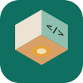
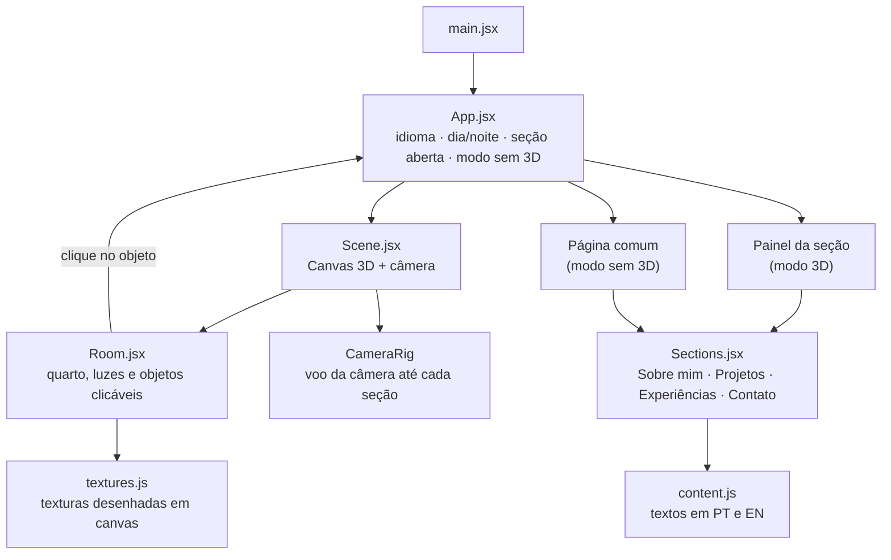
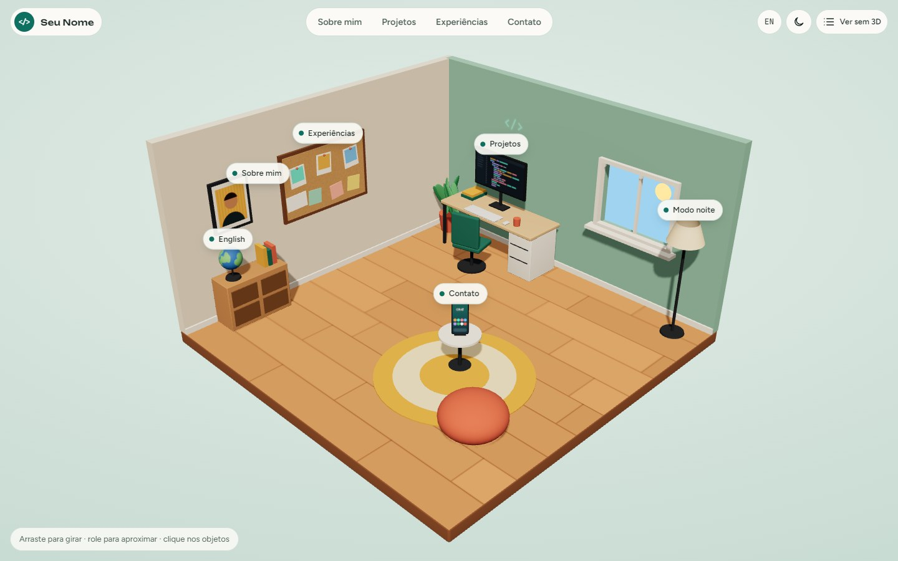
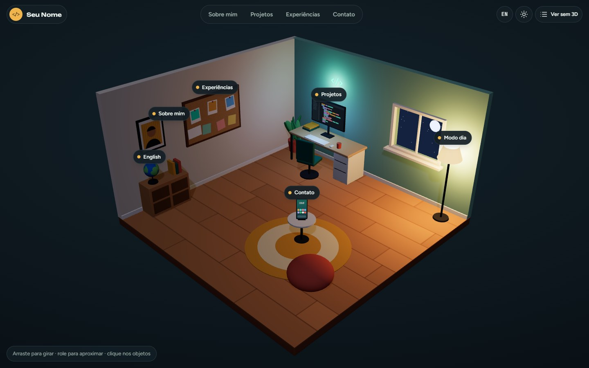
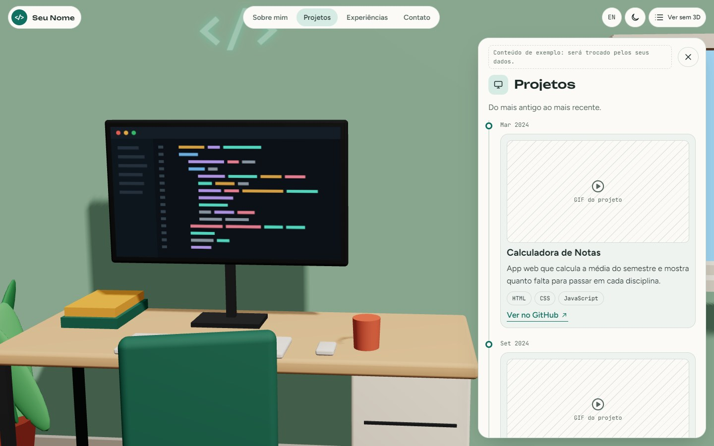
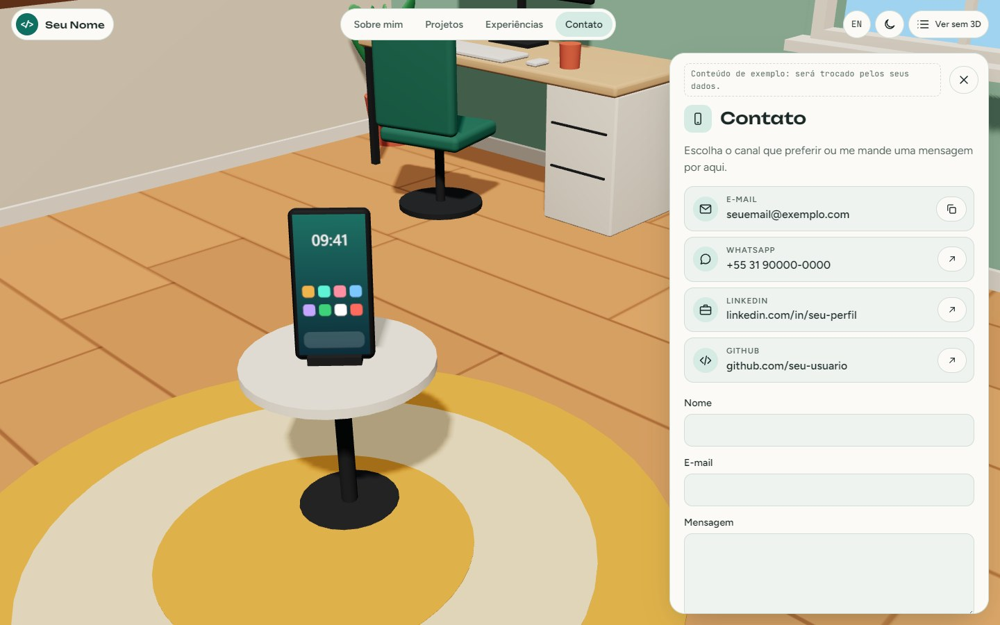
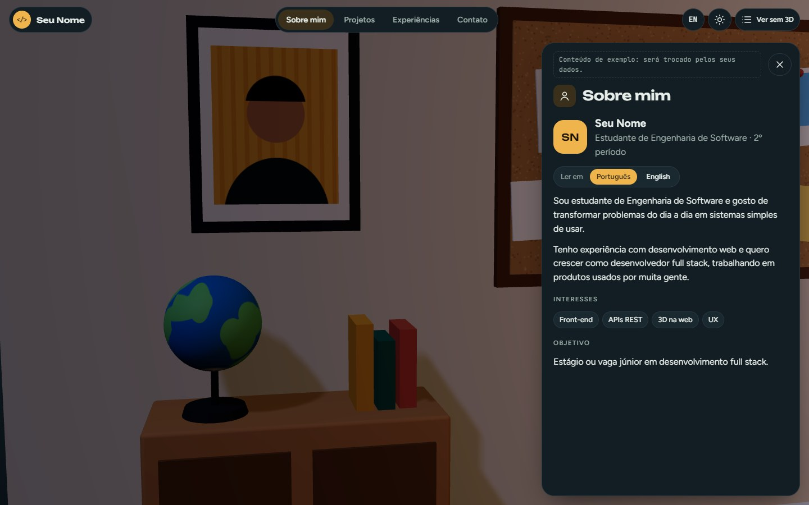
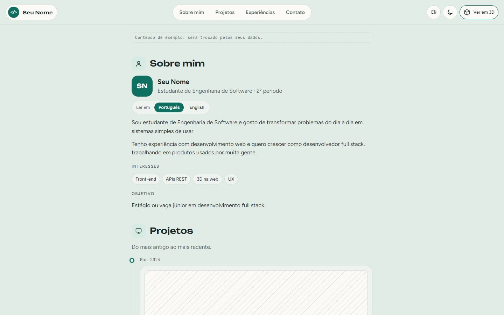
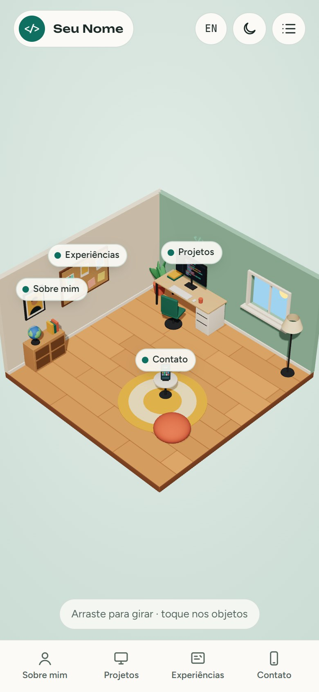
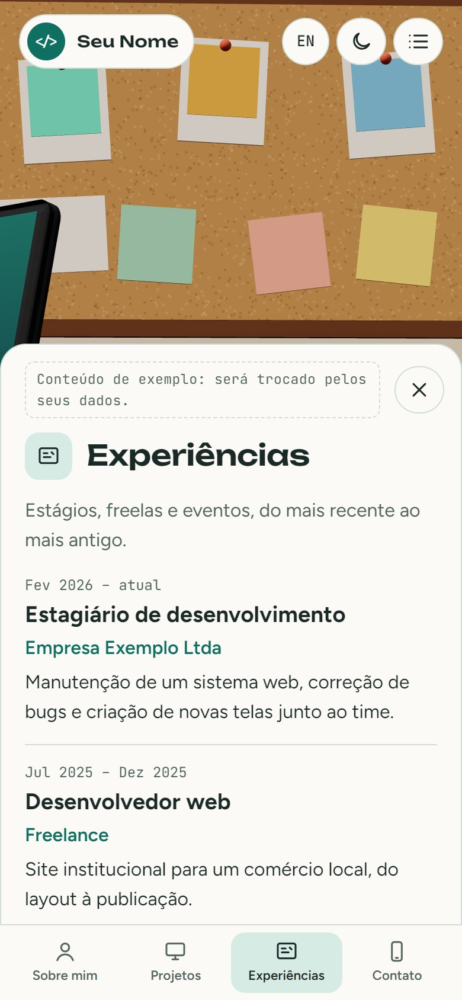

# 🏷️ Quarto Portfólio 3D 👨‍💻

> [!NOTE]
> Portfólio profissional em forma de **quarto 3D interativo**: cada objeto do quarto abre uma seção (Sobre mim, Projetos, Experiências e Contato) e a câmera "voa" até ele. Também tem um **modo sem 3D**, com o mesmo conteúdo em página comum.

<table>
  <tr>
    <td width="800px">
      <div align="justify">
        Este repositório contém o <b>LAB01 – Portfólio Profissional</b> da disciplina <i>Desenvolvimento e Integração de Aplicações Web (DIAW)</i> do curso de <b>Engenharia de Software da PUC Minas</b>, com o <a href="https://github.com/joaopauloaramuni">Prof. Dr. João Paulo Aramuni</a>. Em vez de uma página de rolagem tradicional, o portfólio é um <b>quarto em 3D</b> feito com <i>React</i> e <i>Three.js</i>: o porta-retrato abre o <b>Sobre mim</b>, o monitor abre os <b>Projetos</b>, o mural de cortiça abre as <b>Experiências</b> e o celular abre o <b>Contato</b>. O globo troca o idioma (português/inglês) e a luminária alterna entre dia e noite. O site é <b>responsivo</b> e oferece um <b>modo sem 3D</b> para celulares mais fracos e para acessibilidade.
      </div>
    </td>
    <td>
      <div>
        
      </div>
    </td>
  </tr>
</table>

---

## 🚧 Status do Projeto

[](#-status-do-projeto)     

| Sprint | Entrega | Situação |
| :--- | :--- | :---: |
| **Lab01S01** | README inicial, wireframes no Figma, protótipo do front-end, navegação e layout base | 🟡 Em andamento |
| **Lab01S02** | Conteúdo real em PT/EN, linha do tempo de projetos, experiências, formulário enviando e-mail, preview na Vercel | ⏳ A fazer |
| **Lab01S03** | Deploy final, iluminação "assada" no Blender, GIFs dos projetos, README final e apresentação | ⏳ A fazer |

---

## 📚 Índice
- [Links Úteis](#-links-úteis)
- [Sobre o Projeto](#-sobre-o-projeto)
- [Funcionalidades Principais](#-funcionalidades-principais)
- [Tecnologias Utilizadas](#-tecnologias-utilizadas)
- [Arquitetura](#-arquitetura)
- [Instalação e Execução](#-instalação-e-execução)
  - [Pré-requisitos](#pré-requisitos)
  - [Variáveis de Ambiente](#-variáveis-de-ambiente)
  - [Instalação de Dependências](#-instalação-de-dependências)
  - [Como Executar a Aplicação](#-como-executar-a-aplicação)
- [Deploy](#-deploy)
- [Estrutura de Pastas](#-estrutura-de-pastas)
- [Demonstração](#-demonstração)
  - [Wireframes (Figma)](#-wireframes-figma)
  - [Protótipo do Front-end](#-protótipo-do-front-end)
- [Testes](#-testes)
- [Documentações utilizadas](#-documentações-utilizadas)
- [Autores](#-autores)
- [Contribuição](#-contribuição)
- [Agradecimentos](#-agradecimentos)
- [Licença](#-licença)

---

## 🔗 Links Úteis
* 🌐 **Demo Online:** _em breve_ (será publicado na **Vercel** na Sprint 2)
  > 💻 **Descrição:** link do portfólio em produção.
* 🎨 **Protótipo no Figma:** _link a adicionar_
  > 🖼️ **Descrição:** wireframes de média fidelidade da visão do quarto, do painel de cada seção e da versão de celular.

---

## 📝 Sobre o Projeto

- **Por que existe:** é o trabalho LAB01 da disciplina DIAW, que pede um site de portfólio com menu de navegação, apresentação em português e inglês, projetos em linha do tempo, experiências e um formulário de contato que envia e-mail de verdade.
- **Qual problema resolve:** recrutadores e professores veem muitos portfólios parecidos. Um quarto 3D que a pessoa explora clicando nos objetos deixa a visita mais memorável e já demonstra, na prática, habilidades de front-end e 3D na web.
- **Contexto:** acadêmico (4º período de Engenharia de Software), mas pensado para continuar sendo usado como portfólio profissional depois da disciplina.
- **Onde pode ser usado:** no currículo, no LinkedIn e em processos seletivos de estágio.

O conceito foi inspirado em portfólios 3D conhecidos (ver [Agradecimentos](#-agradecimentos)), evitando problemas que encontramos neles: quarto cortado no celular, painel de debug visível em produção, falta de versão em inglês e de formulário, e conteúdo preso dentro de um iframe de outro site.

---

## ✨ Funcionalidades Principais

- 🧭 **Menu de navegação:** no topo no computador e em abas embaixo no celular; cada item leva a câmera até o objeto da seção.
- 🛋️ **Quarto 3D interativo:** arrastar para girar, rolar para aproximar e clicar (ou tocar) nos objetos. Cada objeto clicável tem uma etiqueta que também funciona pelo teclado.
- 👤 **Sobre mim em PT/EN:** formação, área, interesses e objetivos, com botão Português/English.
- 🗂️ **Projetos em linha do tempo:** do mais antigo ao mais recente, com descrição, tecnologias, link do GitHub e espaço para o GIF do projeto funcionando.
- 💼 **Experiências:** empresa/instituição, cargo/atividade, período e descrição.
- ✉️ **Contato:** ícones clicáveis (e-mail, WhatsApp, LinkedIn, GitHub) e formulário com validação de nome, e-mail e mensagem. _O envio real por e-mail (EmailJS) entra na Sprint 2._
- 🌐 **Internacionalização:** o site inteiro alterna entre português e inglês (pelo menu ou pelo globo do quarto).
- 🌗 **Dia e noite:** começa conforme o tema do sistema; a luminária ou o botão do menu trocam as luzes do quarto, o céu da janela e as cores do site.
- 📄 **Modo sem 3D:** as mesmas seções como página comum. Liga sozinho se o navegador não tiver WebGL.
- ♿ **Acessibilidade:** respeita `prefers-reduced-motion`, a tecla ESC fecha o painel e o foco vai para o título da seção aberta.

---

## 🛠 Tecnologias Utilizadas

### 💻 Front-end

* **Biblioteca de interface:** [React](https://react.dev/) 18.3.1
* **3D:** [Three.js](https://threejs.org/) 0.164.1, [React Three Fiber](https://r3f.docs.pmnd.rs/) 8.16.6 (Three.js em componentes React) e [Drei](https://drei.docs.pmnd.rs/) 9.106.0 (componentes prontos: etiquetas HTML, caixas arredondadas, controle de câmera)
* **Câmera:** [camera-controls](https://github.com/yomotsu/camera-controls) 2.10.1
* **Linguagem:** JavaScript (ES2022+) e JSX
* **Estilização:** CSS puro com variáveis (tokens de cor para dia e noite)
* **Gerenciamento de estado:** estado do próprio React (`useState`), sem biblioteca extra
* **Build tool:** [Vite](https://vitejs.dev/) 5.4.10 com `@vitejs/plugin-react` 4.3.1
* **Fontes:** Unbounded, Figtree e JetBrains Mono (Google Fonts)

### 🖥️ Back-end

* Não há servidor próprio. O envio do formulário será feito pelo **[EmailJS](https://www.emailjs.com/)** direto do navegador _(planejado para a Sprint 2)_.

### ⚙️ Infraestrutura & DevOps

* **Hospedagem:** [Vercel](https://vercel.com/) (plano gratuito) _(planejado)_
* **Modelagem 3D e iluminação:** [Blender](https://www.blender.org/) com o motor Cycles, para "assar" a iluminação em imagens _(planejado para a Sprint 3)_

---

## 🏗 Arquitetura

É uma **SPA (aplicação de página única)** só de front-end. O componente `App` guarda o estado global (idioma, dia/noite, seção aberta e modo sem 3D) e o repassa para a cena 3D e para o painel. Todo o texto fica em `content.js`, separado do código, nos dois idiomas.

Decisões importantes:

- **Navegar = mover a câmera.** Cada seção tem um "ponto de vista" (posição da câmera e ponto para onde ela olha). Ao abrir uma seção, a câmera voa até lá e desloca a imagem para o objeto não ficar escondido atrás do painel.
- **Um conteúdo, duas telas.** Os mesmos componentes de seção (`Sections.jsx`) são usados no painel do modo 3D e no modo sem 3D. Assim o conteúdo nunca fica diferente entre os dois.
- **Quarto feito no código.** Nesta versão o quarto é montado com formas simples (caixas, cilindros, esferas) e texturas desenhadas em `<canvas>`, sem arquivos de terceiros. Na Sprint 3 ele será refeito no Blender com a iluminação "assada" em imagens, para ficar mais bonito sem pesar no celular.
- **Carregamento sob demanda.** A cena 3D é carregada com `lazy()`; o modo sem 3D não precisa dela.



---

## 🔧 Instalação e Execução

### Pré-requisitos

* **Node.js:** versão 18 ou superior
* **Gerenciador de pacotes:** npm (vem com o Node.js)
* **Navegador com WebGL** (Chrome, Edge, Firefox ou Safari atuais). Sem WebGL o site abre direto no modo sem 3D.

---

### 🔑 Variáveis de Ambiente

Nenhuma variável é necessária por enquanto. Quando o envio de e-mail for implementado (Sprint 2), será preciso criar um arquivo **`.env.local`** na raiz do projeto:

| Variável | Descrição | Exemplo |
| :--- | :--- | :--- |
| `VITE_EMAILJS_SERVICE_ID` | ID do serviço de e-mail no EmailJS. | `service_xxxxxxx` |
| `VITE_EMAILJS_TEMPLATE_ID` | ID do modelo de e-mail no EmailJS. | `template_xxxxxxx` |
| `VITE_EMAILJS_PUBLIC_KEY` | Chave pública da conta EmailJS. | `sua_public_key_aqui` |

> **Obs:** no Vite, só as variáveis que começam com `VITE_` ficam disponíveis no código do navegador. Na Vercel, as mesmas variáveis são cadastradas em _Project Settings > Environment Variables_.

---

### 📦 Instalação de Dependências

1. **Clone o repositório:**

```bash
git clone https://github.com/Danielolv14/portfolio.git
cd portfolio
```

2. **Instale as dependências:**

```bash
npm install
```

---

### ⚡ Como Executar a Aplicação

**Modo de desenvolvimento** (recarrega sozinho ao salvar):

```bash
npm run dev
```

🎨 *O site estará disponível em **http://localhost:5173**.*

**Versão de produção local** (gera a pasta `dist/` e a serve):

```bash
npm run build
npm run preview
```

🚀 *A prévia estará disponível em **http://localhost:4173**.*

---

## 🚀 Deploy

O deploy será feito na **Vercel** (plano gratuito), que detecta projetos Vite automaticamente:

1. Entrar em [vercel.com](https://vercel.com/) com a conta do GitHub e clicar em **Add New → Project**.
2. Importar este repositório. A Vercel preenche sozinha: _Framework_ **Vite**, _Build Command_ `npm run build` e _Output Directory_ `dist`.
3. Cadastrar as variáveis do EmailJS (ver [Variáveis de Ambiente](#-variáveis-de-ambiente)).
4. Clicar em **Deploy**. A cada `push` na branch `main` a Vercel publica uma nova versão, e cada Pull Request ganha um link de prévia.

---

## 📂 Estrutura de Pastas

```
.
├── .gitignore                 # 🧹 Ignora node_modules, dist, .env etc.
├── LICENSE                    # ⚖️ Licença MIT.
├── README.md                  # 📘 Este arquivo.
├── index.html                 # 🌐 Página base que o Vite usa (fontes e o <div id="root">).
├── package.json               # 📦 Dependências e scripts (dev, build, preview).
├── vite.config.js             # ⚙️ Configuração do Vite.
│
├── /docs                      # 📚 Documentação
│   ├── logo.svg               # 🏷️ Logo do projeto.
│   └── /prototipos            # 🖼️ Capturas do protótipo usadas neste README.
│
├── /scripts
│   └── artifact-page.mjs      # 📜 Gera uma versão de página única do build (usada para compartilhar o protótipo).
│
└── /src                       # 📂 Código-fonte React
    ├── main.jsx               # 🚪 Ponto de entrada: monta o <App />.
    ├── App.jsx                # 🧠 Estado global, menu, painel das seções e modo sem 3D.
    ├── Scene.jsx              # 🎥 Canvas 3D e câmera (pontos de vista de cada seção).
    ├── Room.jsx               # 🛋️ O quarto: paredes, móveis, luzes e objetos clicáveis.
    ├── textures.js            # 🎨 Texturas desenhadas em <canvas> (chão, tela do monitor, cortiça...).
    ├── Sections.jsx           # 🧱 As quatro seções (usadas no painel e no modo sem 3D).
    ├── Icons.jsx              # 💡 Ícones em SVG.
    ├── content.js             # 🌎 Todo o texto do site em português e inglês.
    └── styles.css             # 🎨 Estilos globais e tokens de cor (dia e noite).
```

---

## 🎥 Demonstração

> [!WARNING]
> O conteúdo das capturas abaixo ainda é **de exemplo** ("Seu Nome", projetos e experiências fictícios) e será trocado pelos dados reais na Sprint 2.

### 🎨 Wireframes (Figma)

_Os wireframes de média fidelidade serão adicionados aqui, com o link do Figma em [Links Úteis](#-links-úteis)._

| Visão do quarto | Painel de uma seção | Versão de celular |
| :---: | :---: | :---: |
| _a adicionar_ | _a adicionar_ | _a adicionar_ |

### 💻 Protótipo do Front-end

| Visão geral (dia) | Visão geral (noite) |
| :---: | :---: |
|  |  |
| **Projetos (câmera no monitor)** | **Contato (câmera no celular)** |
|  |  |
| **Sobre mim (noite)** | **Modo sem 3D** |
|  |  |

| Celular: visão geral | Celular: Experiências |
| :---: | :---: |
|  |  |

---

## 🧪 Testes

Ainda não há testes automatizados. A cada entrega o site é verificado manualmente:

- abrir cada seção pelo menu, pelas etiquetas e clicando nos objetos;
- trocar idioma e dia/noite com uma seção aberta e fechada;
- testar no computador e no celular (tela em pé), e no modo sem 3D;
- enviar o formulário vazio, com e-mail inválido e preenchido corretamente;
- navegar só com o teclado (Tab, Enter e ESC).

---

## 🔗 Documentações utilizadas

* 📖 **Biblioteca de interface:** [Documentação oficial do **React**](https://react.dev/reference/react)
* 📖 **3D:** [Documentação do **Three.js**](https://threejs.org/docs/), do [**React Three Fiber**](https://r3f.docs.pmnd.rs/) e do [**Drei**](https://drei.docs.pmnd.rs/)
* 📖 **Câmera:** [**camera-controls**](https://github.com/yomotsu/camera-controls)
* 📖 **Build tool:** [Guia de configuração do **Vite**](https://vitejs.dev/config/)
* 📖 **Formulário:** [Documentação do **EmailJS**](https://www.emailjs.com/docs/)
* 📖 **Deploy:** [**Vite** na **Vercel**](https://vercel.com/docs/frameworks/vite)
* 📖 **Guia de estilo:** [**Conventional Commits**](https://www.conventionalcommits.org/en/v1.0.0/)

---

## 👥 Autores

| 👤 Nome | 🖼️ Foto | :octocat: GitHub | 💼 LinkedIn | 📤 Gmail |
|---------|----------|-----------------|-------------|-----------|
| Daniel Oliveira | <div align="center"></div> | <div align="center"><a href="https://github.com/Danielolv14"></a></div> | <div align="center"><a href="https://www.linkedin.com/"></a></div> | <div align="center"><a href="mailto:"></a></div> |

---

## 🤝 Contribuição

Este é um projeto individual da disciplina, mas sugestões são bem-vindas:

1. Faça um `fork` do projeto.
2. Crie uma branch para sua sugestão (`git checkout -b feature/minha-sugestao`).
3. Faça o commit (`git commit -m 'feat: descreve a sugestão'`), seguindo o [Conventional Commits](https://www.conventionalcommits.org/en/v1.0.0/).
4. Envie a branch (`git push origin feature/minha-sugestao`).
5. Abra um **Pull Request**.

---

## 🙏 Agradecimentos

* [**Engenharia de Software PUC Minas**](https://www.instagram.com/engsoftwarepucminas/) - pelo apoio institucional e pela estrutura acadêmica.
* [**Prof. Dr. João Paulo Aramuni**](https://github.com/joaopauloaramuni) - pela proposta do trabalho e pelo template deste README.
* [**Bruno Simon**](https://bruno-simon.com/) - referência em portfólios 3D na web ("My Room in 3D").
* [**Henry Heffernan**](https://henryheffernan.com/) - inspiração para o portfólio em forma de ambiente explorável.
* [**Room_Portfolio (AT010303)**](https://github.com/AT010303/Room_Portfolio) - estudado para entender a iluminação "assada" no Blender e a navegação pela câmera.

---

## 📄 Licença

Este projeto é distribuído sob a **[Licença MIT](LICENSE)**.

---
